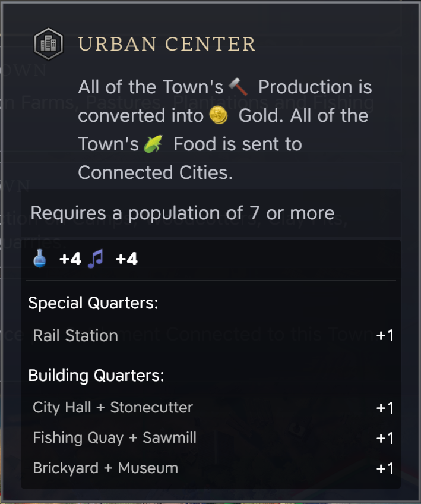
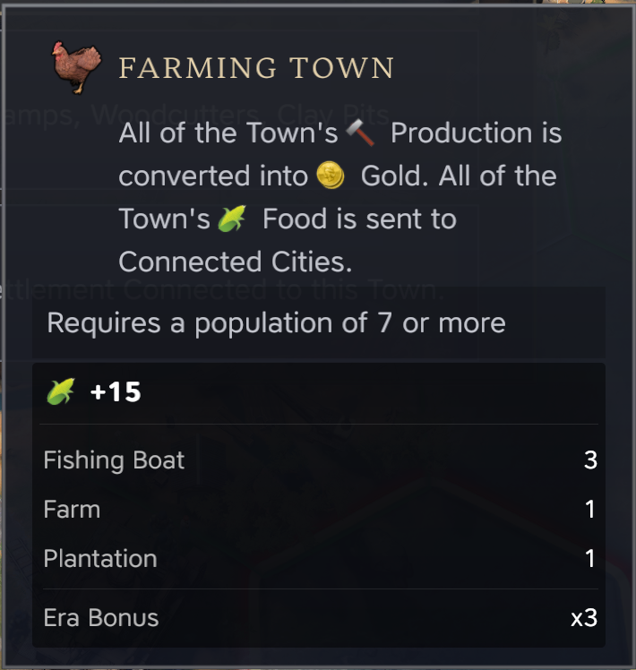
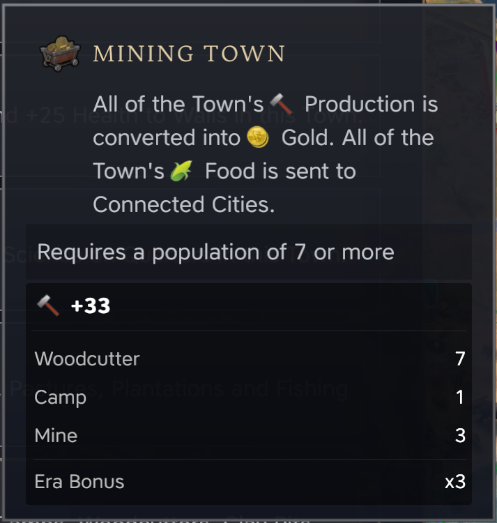
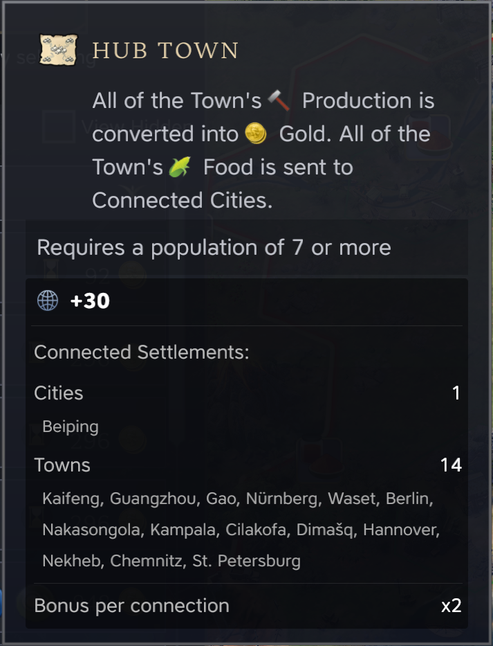
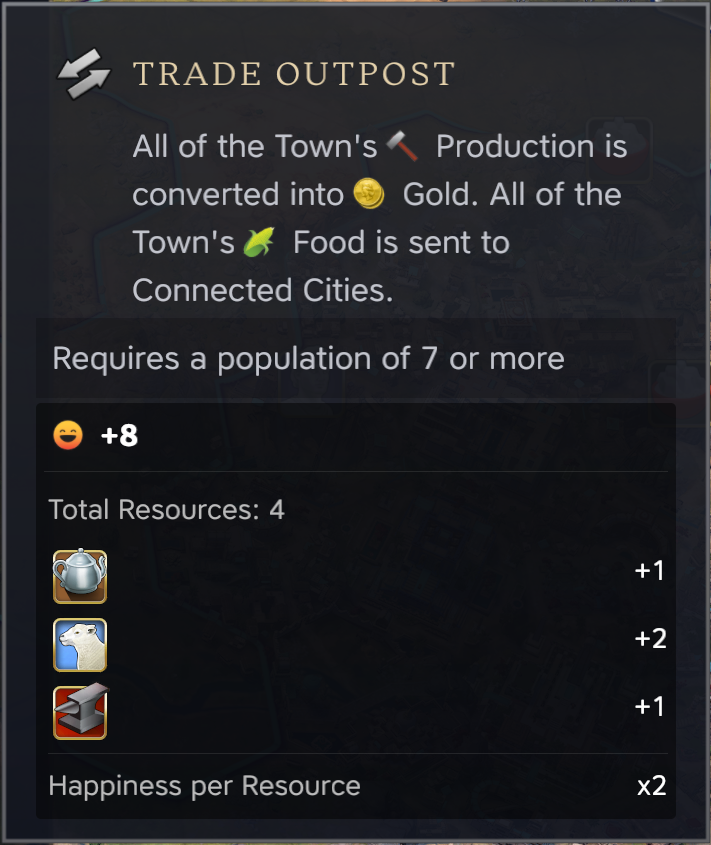

# Enhanced Town Focus Info

A mod for Civilization VII that enhances the display of town focus yield bonuses, showing detailed breakdowns of improvements, buildings, and trade routes that contribute to specialization bonuses.

## Version 1.1.6

### What's New
- Added Russian language support (Thanks to Webrok for the translations!)

### Features
- Detailed breakdown of specialization bonuses
- Support for multiple languages (English, Japanese, Italian, Russian)
- Visual improvements and detailed tooltips
- Era bonus multiplier display
- Resource and happiness calculations
- Trade route connection details

### Languages
- English
- Japanese
- Italian
- Russian (New!)

### Credits
- Original work by Yamada
- Maintained by Mallek
- Russian translations by Webrok

## Overview
Enhanced Town Focus Info is a quality-of-life mod for Civilization VII that provides detailed breakdowns of yield bonuses when selecting town specializations. This mod enhances the tooltip display to show exactly how many buildings, improvements, and trade routes contribute to each specialization's bonuses.

*Based on the original Town Focus Boost Info mod by Yamada, enhanced and maintained by Mallek*

## Features

### Urban Center Focus
Shows detailed breakdown of Science and Culture bonuses from:
- Special Quarters (like Rail Stations)
- Building Quarters (stacked buildings)
- Individual contribution of each quarter



### Farming Town Focus
Shows Food yield bonuses from:
- Farms
- Pastures
- Plantations
- Era multiplier bonuses (2x in Exploration Age, 3x in Modern Age)



### Mining Town Focus
Details Production bonuses from:
- Mines
- Woodcutters
- Quarries
- Clay Pits
- Camps
- Era multiplier effects (2x in Exploration Age, 3x in Modern Age)



### Hub Town Focus
Shows Diplomacy bonuses from:
- Domestic trade routes (+2 per route)
- Detailed route count and breakdown



### Trade Town Focus
Shows Happiness bonuses from:
- Resource tiles in town territory
- Visual resource icons with counts
- Happiness multiplier (+2 per resource)



## Installation

### Method 1: Steam Workshop (Coming Soon!)
The mod will be available on the Official Civilization VII Mod Browser once mod support is released.

### Method 2: Manual Installation (Currently Recommended)
1. Download the mod files
2. Navigate to your Civilization VII mods folder:
   - Press `Windows Key + R`
   - Type `%localappdata%` and press Enter
   - Navigate to `Firaxis Games\Sid Meier's Civilization VII\Mods`
3. Copy all mod files into this folder
4. Launch Civilization VII
5. Enable the mod in the Additional Content menu
6. Start or load a game

Note: The full path should look like:
```
C:\Users\[YourUsername]\AppData\Local\Firaxis Games\Sid Meier's Civilization VII\Mods\EnhancedTownFocusInfo
```

## Compatibility
- Works with Civilization VII base game
- Compatible with most other UI mods
- Does not affect save games

## Known Issues
- Font scaling may be too small on 4K/high-resolution displays

## Contributing
Feel free to contribute to this project by:
- Reporting bugs
- Suggesting improvements
- Submitting pull requests
- Helping with translations (see Localization section below)

## Localization
The mod now supports multiple languages! All text strings are stored in localization files under the `modules/text` directory.

To contribute a new translation:

1. Create a new directory under `modules/text` with your language code (e.g., `fr_FR` for French)
2. Copy `ModuleText.xml` from the `en_us` directory to your new language directory
3. Translate the strings in your new file
4. Add the SQL translations to `ETFI_Text.sql`
5. Update the modinfo file to include your new language file
6. Submit a pull request or send the files to the mod maintainers

Current language support:
- English (en_US)
- Japanese (ja_JP)
- Italian (it_IT)
- *More coming soon with community help!*

## Credits
- Original mod concept by Yamada
- Enhanced and maintained by Mallek
- Italian translation by RockFactory
- Thanks to the Civilization VII modding community

## License
This project is licensed under the MIT License - see the LICENSE file for details

## Version History
- 1.1.6: Russian Localization Update
  - Added Russian language support (thanks to Webrok!)
  - Updated documentation
  - Minor code improvements
- 1.1.5: Italian Localization Update
  - Added Italian language support (thanks to RockFactory!)
  - Fixed semicolon issues in localization file
  - Improved code organization
  - Updated documentation
- 1.1.4: Trade Town Enhancement
  - Added resource icons to Trade Town tooltip
  - Improved resource counting accuracy
  - Added caching for better performance
  - Cleaned up tooltip formatting
- 1.1.3: UI Polish Update
  - Added + signs to all yield numbers
  - Increased icon sizes for better visibility
  - Improved tooltip spacing and alignment
  - Fixed font scaling issues
- 1.1.2: Resource System Update
  - Added detailed resource breakdown for Trade Towns
  - Improved territory tile detection
  - Added happiness calculation display
  - Fixed various edge cases in resource counting
- 1.1.1: Trade Route Enhancement
  - Added connected settlement names to Hub Town tooltip
  - Improved tooltip formatting and readability
  - Added development mode for easier debugging
  - Font size consistency improvements
- 1.1.0: Localization Update
  - Added Japanese language support
  - Reorganized file structure for better localization support
  - Fixed building name translations in tooltips
  - Improved era multiplier display
- 1.0.5: Initial Release
  - Complete rewrite of tooltip system
  - Added detailed breakdowns for all focus types
  - Improved visual presentation
  - Added era multiplier display
